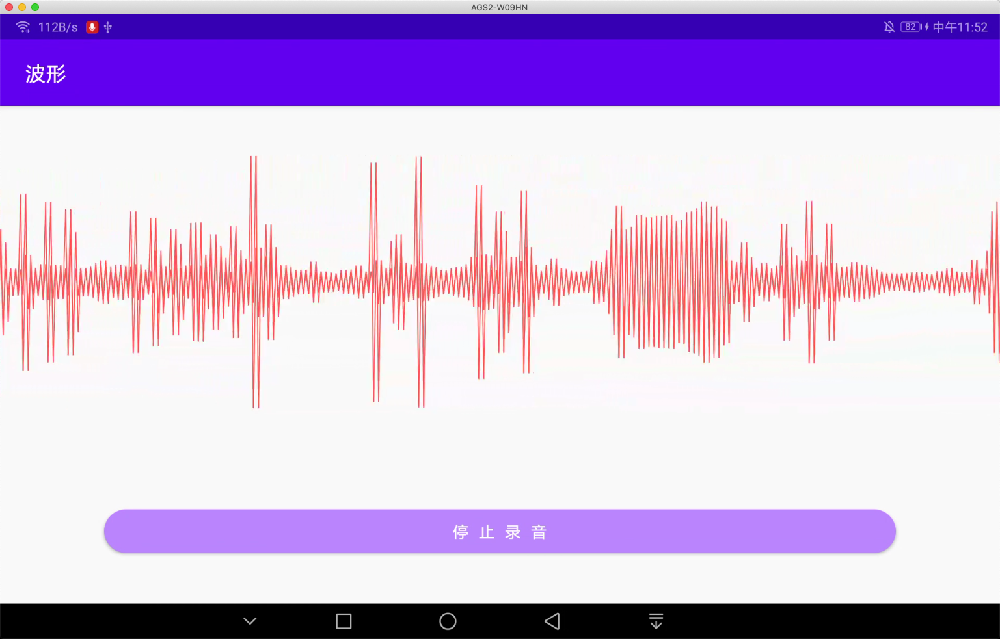

[奇梦者](http://www.qdreamer.com/) —— 波形图
--



&emsp;&emsp;布局文件中添加 WaveView 组件；支持两个自定义属性：

- waveColor: 设置波形的颜色
- waveCount: 设置一个屏幕宽度绘制多少个波形线；（默认 640 条）

```xml
<com.qdreamer.audiowave.WaveView
    android:id="@+id/waveView"
    android:layout_width="match_parent"
    android:layout_height="200dp"
    app:waveColor="#FF5252"
    app:waveCount="640" />
```

&emsp;&emsp;具体使用请参照 [MainActivity](app/src/main/java/com/example/myapplication/MainActivity.java)，主要对应 3 个方法：

- clear()
- feedAudioData(byte[])
- stop()

